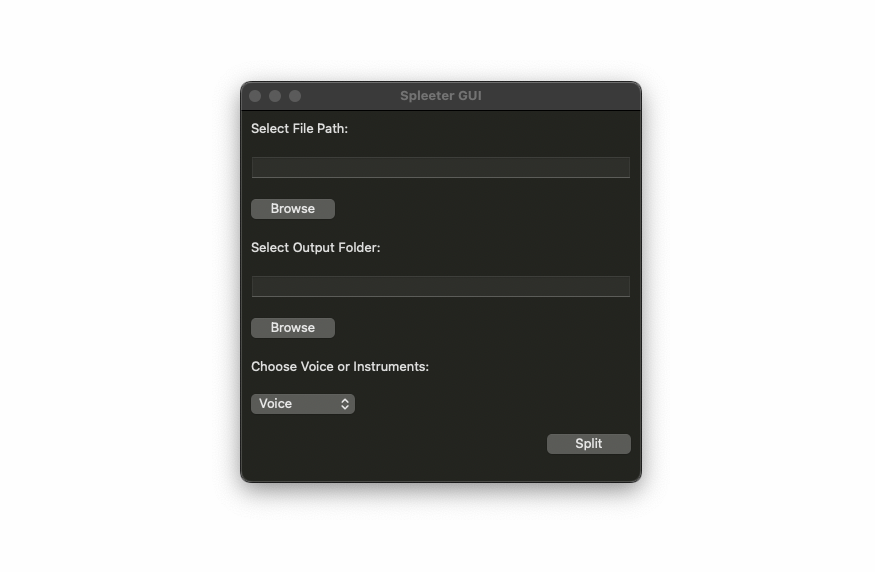

# Spleeter GUI

Spleeter GUI is a graphical application built with wxPython for utilizing [Spleeter](https://github.com/deezer/spleeter), an open-source library developed by Deezer for separating audio tracks into vocals and instruments.

## Key Features

- **Audio File Selection:** Easily select the audio file (supported formats: mp3, wav) you want to separate into vocal and instrumental tracks.
- **Output Folder Selection:** Specify a destination folder to save the separated tracks.
- **Mode Selection:** Choose between 'Voice' (2stems) or 'Instruments' (5stems) separation mode.
- **Asynchronous Operation:** The application separates audio tracks in a separate thread to keep the user interface responsive during the separation process.

## How to Use the Application

1. **Select File:** Click the "Browse" button next to "Select File Path" to choose the audio file for separation.
2. **Select Output Folder:** Click the "Browse" button next to "Select Output Folder" to pick the folder where the separated tracks will be saved.
3. **Choose Mode:** Select 'Voice' to separate vocals or 'Instruments' to separate instruments.
4. **Perform Separation:** Click the "Split" button to initiate the separation process. The result will be saved in the selected output folder.

## Requirements

- [Python](https://www.python.org/) (recommended version: 3.6 or above)
- [wxPython](https://wxpython.org/) (automatically installed when running the app)
- [Spleeter](https://github.com/deezer/spleeter) (automatically installed when running the app)

## How to Run the Application

1. Clone the repository: `git clone https://github.com/tuononen/spleeter-gui.git`
2. Navigate to the project directory: `cd spleeter-gui`
3. Run the application: `python gui.py`

## Contributions

We welcome contributions and improvements. If you have suggestions, issues, or would like to contribute, feel free to create a pull request or open an issue.
